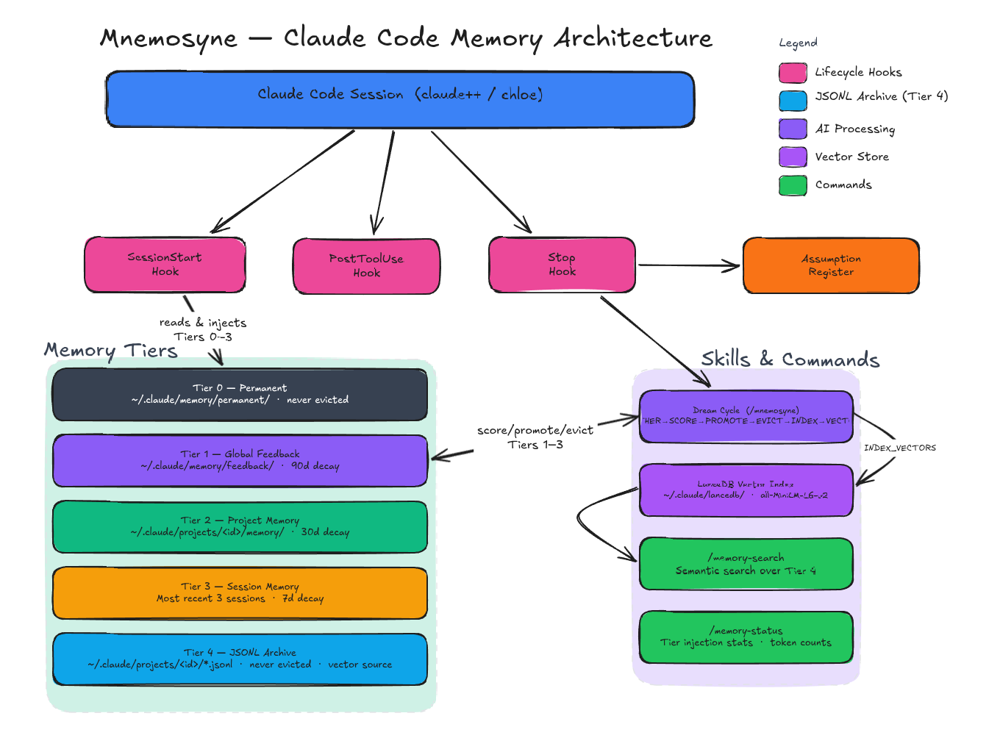

# Mnemosyne

**CIA-grounded memory management layer for Claude Code.**

Mnemosyne implements a structured 5-tier memory architecture for [Claude Code](https://claude.ai/code), grounded in the *Conversation Intelligence Architecture* (CIA) framework. It fixes context bleed between projects, enforces scoped memory tiers with eviction policies, and surfaces implicit assumptions that accumulate invisibly across sessions.

This is not a standalone application — it is a set of hooks, skills, and scripts that integrate directly with the `~/.claude/` infrastructure.



---

## The Problem

The default Claude Code memory setup has several observable failures:

| Failure | Symptom |
|---------|---------|
| **Context bleed** | Fragments from other projects appear in unrelated sessions |
| **No memory tiers** | Everything goes into one flat `memory/` directory with no scope distinction |
| **No eviction** | Memories accumulate indefinitely; MEMORY.md grows without pruning |
| **No relevance scoring** | All memories treated as equally worth loading |
| **Fragile consolidation** | Dream skill runs inconsistently with no quality criterion |
| **No assumption register** | Implicit premises become invisible background that shapes all reasoning |

---

## The Architecture

### 5-Tier Memory System

| Tier | Scope | Location | Loaded When | Eviction |
|------|-------|----------|-------------|---------|
| **0 — Permanent** | Global, never evicts | `~/.claude/memory/permanent/` | Every session | Manual only |
| **1 — Global Feedback** | Cross-project preferences | `~/.claude/memory/feedback/` | Every session, capped at 50 entries | 90 days without reinforcement |
| **2 — Project Memory** | Project-scoped decisions | `~/.claude/projects/<encoded>/memory/` | When cwd matches project | 30 days without reference |
| **3 — Session Memory** | Recent session summaries | `~/.claude/projects/<encoded>/memory/sessions/` | Most recent 3 sessions | 7 days |
| **4 — Verbatim Archive** | Full JSONL journey | `~/.claude/projects/<encoded>/` | Never injected — query only | Never |

Total injected context is capped at **~3000 tokens**. Tier 3 is evicted first when over budget.

### Memory File Schema

Every memory file uses this frontmatter:

```markdown
---
name: Short descriptive name
type: feedback | user | project | reference
recorded_at: 2026-04-17
valid_until: indefinite | 2026-06-01 | superseded-2026-04-17
scope: global | project:<name>
---

Memory content here.

**How to apply:** When and how this should affect behavior.
```

The `valid_until` field implements **bitemporal context management**: corrections mark the old entry's `valid_until` as `superseded-<date>` rather than deleting it. The audit trail is preserved.

### Components

```
~/.claude/
├── memory/
│   ├── permanent/          ← Tier 0: always loaded, never evicted
│   │   └── *.md
│   └── feedback/           ← Tier 1: cross-project, 90-day decay
│       └── *.md
├── scripts/hooks/
│   ├── mnemosyne-session-start.js   ← SessionStart: inject Tiers 0+1 + assumptions
│   └── mnemosyne-stop.js            ← Stop: extract assumptions from transcript
├── skills/mnemosyne/
│   ├── SKILL.md             ← /mnemosyne slash command (dream cycle)
│   ├── dream-gather.js      ← GATHER phase utility
│   └── dream-evict.js       ← EVICT phase utility
└── commands/
    └── memory-status.md     ← /memory-status slash command
```

---

## Prerequisites

- [Claude Code](https://claude.ai/code) installed and configured
- Node.js 18+ on your PATH
- `~/.claude/settings.json` must exist (created by Claude Code on first run)

---

## Installation

```bash
git clone https://github.com/tlarcombe/mnemosyne ~/projects/Mnemosyne
bash ~/projects/Mnemosyne/install.sh
```

The installer is **idempotent** — safe to re-run after Claude Code updates.

### What the installer does

| Step | Action |
|------|--------|
| `[1/10]` | Create `~/.claude/memory/permanent/` and `~/.claude/memory/feedback/` |
| `[2/10]` | Deploy Tier 0 seed files (skips if already customised) |
| `[3/10]` | Deploy `mnemosyne-session-start.js` to `~/.claude/scripts/hooks/` |
| `[4/10]` | Deploy `memory-status.md` to `~/.claude/commands/` |
| `[5/10]` | Wire `mnemosyne:session:tiers` as first SessionStart hook in `settings.json` |
| `[6/10]` | Patch `session-start.js` to fix cross-project context bleed |
| `[7/10]` | Deploy `/mnemosyne` dream skill to `~/.claude/skills/mnemosyne/` |
| `[8/10]` | Deploy `mnemosyne-stop.js` and wire it as async Stop hook |
| `[9/10]` | Deploy `chloe` launcher to `~/.local/bin/chloe` |
| `[10/10]` | Deploy Phase 4 search scripts, `npm install`, deploy `/memory-search` command |

### Post-install steps

**1. Migrate existing memories** (first time only)

If you have existing Claude Code project memories, migrate them to the Mnemosyne schema:

```bash
node ~/projects/Mnemosyne/scripts/migrate-memories.js
```

This adds `recorded_at`, `valid_until: indefinite`, and `scope: project:<name>` frontmatter to all existing memory files. Safe to re-run (skips already-migrated files).

**2. Customise your Tier 0 seeds**

Edit the permanent memory seeds to reflect your identity and preferences:

```bash
# Your identity — who you are, background, how Claude should interact with you
nano ~/.claude/memory/permanent/user-identity.md

# Your global workflow preferences — applies to every project
nano ~/.claude/memory/permanent/global-workflow.md
```

**3. Restart Claude Code**

The new SessionStart hook activates on the next session start.

**4. Verify installation**

In any Claude Code session:

```
/memory-status
```

Expected output: shows Tier 0/1 contents, token count, and current project memory status.

---

## Usage

### `/memory-status`

Shows what memory is currently loaded, from which tier, and the token budget used.

```
/memory-status
```

### `/mnemosyne` — The Dream Cycle

Runs the 5-phase CIA memory consolidation cycle. Triggered automatically every 24 hours (when `~/.claude/.dream-pending` exists at session start), or manually:

```
/mnemosyne
```

**The 5 phases:**

| Phase | What happens |
|-------|-------------|
| **GATHER** | Scans recent JSONL sessions for high-signal patterns (corrections, preferences, decisions) |
| **SCORE** | Applies CIA scoring: Recency × Relevance × Confidence × Currency |
| **PROMOTE** | Writes high-scoring candidates to the appropriate memory tier |
| **EVICT** | Marks expired/superseded memories (never deletes — bitemporal pattern) |
| **INDEX** | Rebuilds `MEMORY.md` index files for all touched tiers |

After completion, writes a run report to `~/.claude/memory/dream-last-run.md`.

#### CIA Scoring Rubric

| Dimension | High (0.8–1.0) | Medium (0.4–0.7) | Low (0.0–0.3) |
|-----------|----------------|------------------|---------------|
| **Recency** | Within 3 days | 4–14 days | 15+ days |
| **Relevance** | Fits an existing memory category directly | Fits with interpretation | Marginal fit |
| **Confidence** | Explicit instruction ("always", "never", correction) | Clear preference | Implied or ambiguous |
| **Currency** | Still matches current code/config/state | Partially applicable | Contradicts current state |

**Tier assignment thresholds:**

| Score | Action |
|-------|--------|
| > 0.7, universal scope | Promote to Tier 0 (permanent) — *requires explicit user intent, not automated* |
| > 0.6, cross-project | Promote to Tier 1 (feedback) |
| > 0.4, project-specific | Promote/update Tier 2 (project memory) |
| < 0.2 | Skip |

### Assumption Register

At every session end, `mnemosyne-stop.js` pattern-matches your messages for **implicit assumption signals** — things you treated as settled background without stating them explicitly. These are written to:

```
~/.claude/projects/<encoded>/memory/assumptions.md
```

The 3 most recently written assumptions are surfaced at the **start of every session** so they can be challenged rather than silently inherited.

**Signal categories detected:**

| Category | Detects | Example trigger |
|----------|---------|----------------|
| `correction` | You reveal what you assumed Claude knew | "I thought you knew…", "I assumed…" |
| `explicit` | Stated as given background | "Given that…", "Assuming that…" |
| `tech-stack` | Technology treated as settled | "This project uses Node.js" |
| `state` | Assumed world state | "X should already be there" |
| `decision` | Agreed approach not formally recorded | "We're using…", "The plan is…" |

---

## Dream Automation

Mnemosyne's dream cycle can run automatically every 24 hours. Add this to your `~/.claude/CLAUDE.md`:

```markdown
## Auto Dream

If the file `~/.claude/.dream-pending` exists at session start, run `/mnemosyne` as a subagent
in the background, then delete the flag file: `rm ~/.claude/.dream-pending`.
```

The installer sets up a Stop hook (`stop:dream-pending`) that writes the flag when consolidation is due.

---

## Manual Utilities

Run the gather and evict utilities directly for inspection:

```bash
# Scan last 7 days of sessions for signal candidates
node ~/.claude/skills/mnemosyne/dream-gather.js --days 7

# Preview what would be evicted (dry run)
node ~/.claude/skills/mnemosyne/dream-evict.js --dry-run

# Run eviction for real
node ~/.claude/skills/mnemosyne/dream-evict.js
```

---

## Re-applying After Claude Code Updates

The context bleed fix patches `~/.claude/scripts/hooks/session-start.js`. If Claude Code updates this file, re-run the installer:

```bash
bash ~/projects/Mnemosyne/install.sh
```

If the patch target has changed (new ECC version), follow the manual instructions in:

```
docs/patches/session-start-bleed-fix.md
```

---

## Memory Management

### Adding a new Tier 0 memory

```bash
cat > ~/.claude/memory/permanent/my-preference.md << 'EOF'
---
name: My preference
type: feedback
recorded_at: 2026-04-18
valid_until: indefinite
scope: global
---

The memory content here.

**How to apply:** When and how this should affect behavior.
EOF
```

### Adding a new Tier 1 memory

Same as above but write to `~/.claude/memory/feedback/`.

### Superseding a memory

Never delete memory files. Instead, set `valid_until`:

```markdown
valid_until: superseded-2026-04-18
```

Then write a new file with the corrected fact. This preserves the audit trail.

### Viewing the assumption register for a project

```bash
# Replace with your project's encoded path
cat ~/.claude/projects/-home-you-projects-myproject/memory/assumptions.md
```

---

## Implementation Phases

| Phase | Status | Description |
|-------|--------|-------------|
| **Phase 1** — Foundations | ✅ Complete | Schema migration, Tier 0/1 injection, context bleed fix, `/memory-status` |
| **Phase 2** — Dream Rebuilt | ✅ Complete | 5-phase CIA dream cycle, scoring function, bitemporal eviction, run report |
| **Phase 3** — Assumption Register | ✅ Complete | Stop hook extraction, `assumptions.md`, SessionStart surfacing |
| **Phase 4** — Vector Search | ✅ Complete | LanceDB (embedded) + all-MiniLM-L6-v2 embeddings, `/memory-search` command, dream cycle integration |

---

## Architecture Notes

### Context Bleed Fix

The root cause: Claude Code's `session-start.js` falls back to loading the most-recent session from **any** project when no exact project match is found (`recency-fallback`). Mnemosyne patches this to skip recency-fallback sessions entirely:

```javascript
if (result.matchReason === 'recency-fallback') {
  log(`[SessionStart] Skipping session (recency-fallback — Mnemosyne isolation)`);
} else {
  // load session context normally
}
```

### Token Budget

Tiers 0 and 1 share a 3000-token budget (~12,000 characters). Tier 0 always loads in full. Tier 1 fills the remaining budget, capped at 50 entries. Assumptions add at most ~1200 characters. The SessionStart hook logs the actual token usage to stderr:

```
[Mnemosyne] Tier 0: 2 files | Tier 1: 3 files | Assumptions: 2 | ~380 tokens | cwd: /home/you/projects/myproject
```

### Hook Execution Order

In `settings.json`, the `SessionStart` hooks are ordered:
1. `mnemosyne:session:tiers` — injects Tiers 0+1 + assumptions
2. `session:start` (ECC) — loads session history and project context

The Mnemosyne hook runs first so its `additionalContext` is prepended to everything else.

---

## License

MIT
